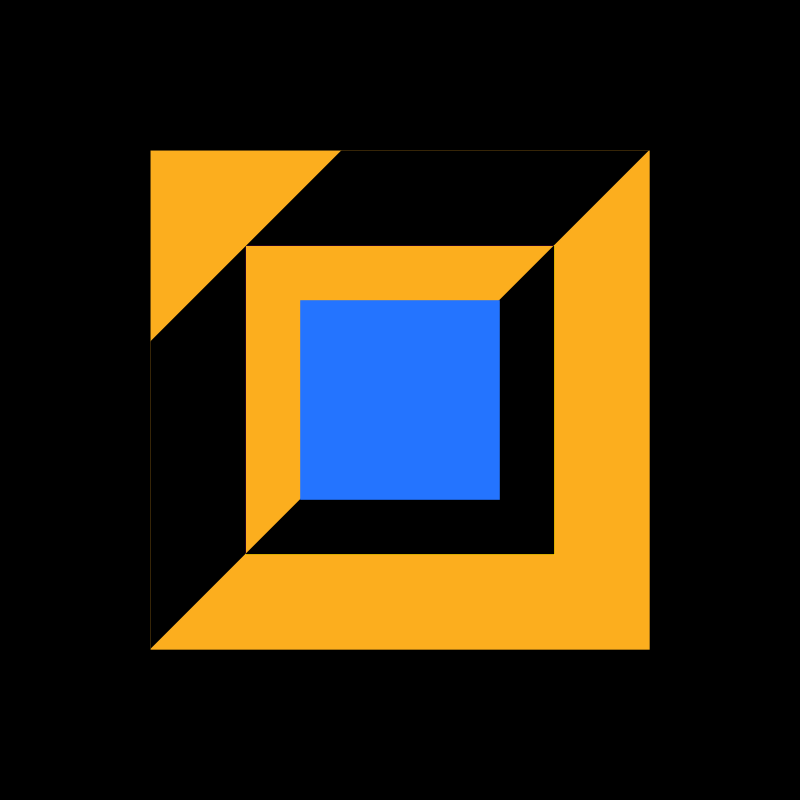
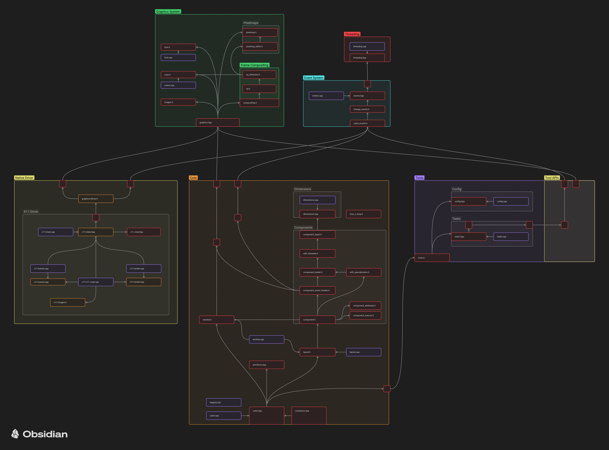

<h1 align="center">
  <br>
  
  <br>
  CYD UI
  <br>
</h1>

<h4 align="center">A C++ library for building native user interfaces</h4>

<p align="center">


</p>

<p align="center">
  <a href="#key-features">Key Features</a> •
  <a href="#installation">Installation</a> •
  <a href="#how-to-use">How To Use</a> •
  <a href="#code-architecture">Code Architecture</a> •
  <a href="#credits">Credits</a> •
  <a href="#license">License</a>
</p>

> **NOTE:** 
> Currently, only **Linux** with the **X11 Window System** is supported.

## Key Features

* **Declarative** - Or as close as it can get with c++ syntax and macros
* **Event Driven** - Built-in event bus extensible with custom events
* **Component Oriented** - Declare encapsulated components and reuse them anywhere
* **Header-only UIs** - A single component in a header file is renderable UI
* **Reactive sizing of components** - Relations can be established between different dimensions
* **Multi-threaded** - Separate event and render threads as well as a custom task runner

### Road map

* Better abstraction for component styling
  - Integrate with CSS (or similar)
* Cross-platform
  - Windows, macOS and Linux ready.

## Installation

Everything needed in order to use this library is located inside `dist/`, header files to be included in the project are in `dist/include`.

Make sure the binary `dist/libcyd_ui.a` is linked to the project and that the header files are included:

```cmake
# ...

include_directories(<PATH TO HEADER FILES DIRECTORY>)
target_link_libraries(<EXECUTABLE> PUBLIC <PATH TO BINARY libcyd_ui.a>)
```

### Dependencies

Any project using this library must also link against the following libraries:

- X11
- Xft
- Xrender
- fontconfig
- yaml-cpp
- jpeg

```cmake
# ...

# On some systems, it may be needed to include the headers directory
# for freetype2. On Arch Linux: /usr/include/freetype2
include_directories(<PATH TO FREETYPE2 HEADERS>)

target_link_libraries(<EXECUTABLE> PUBLIC X11 Xft Xrender)
target_link_libraries(<EXECUTABLE> PUBLIC fontconfig)
target_link_libraries(<EXECUTABLE> PUBLIC yaml-cpp)
target_link_libraries(<EXECUTABLE> PUBLIC jpeg)
```

## How To Use

Each component must have a declaration for a state class and a component class. This is done with the `STATE(NAME){}` and `COMPONENT(NAME){}` macros.

The name must be a valid class name.


### Example Component
This example declares a component that displays an orange rectangle with black text inside.
A third component is added 40 pixels down from the top.

```cpp
// SomeComponent.hpp

#include "cydui.hpp"

// Declare STATE class for component
//   This one persists across renders
STATE(SomeComponent) { // Expands to 'SomeComponentState'
  // Color instances
  color::Color fg_color = "#FCAE1E"_color;
  color::Color fg_inv_color = "#000000"_color;
  
  // Font specification
  font::Font font {
    .name = "Fira Code Retina",
    .size = 10,
  };
  
  INIT_STATE(SomeComponent) {
    // Optional initialization code...
  }
};

// Declare COMPONENT class for component
//   This one may be created or destroyed at any moment
//   In general, if it's not on screen it's not here either
COMPONENT(SomeComponent) {
  PROPS({ // Passed from parent on each render
    std::string label;
  })
  
  INIT(SomeComponent) {
    // Optional initialization code...
  }
  
  REDRAW {
    // Declare contents of this component
    
    // 'props' Holds the properties for this render as the type declared
    //         above with PROPS({...}).
    // 'state' Is a reference to the relevant SomeComponentState instance.
    // 'dim'   Contains the dimensions of this instance of SomeComponent.
    //         x/y   - position relative to parent
    //         cx/cy - absolute position relative to top-left corner of the window
    //         w/h   - absolute size
    //         cw/ch - content size, accounting for padding and margin
    add({
      COMP(Rectangle)({
        .props = {                  // Set properties of children component
          .color = state->fg_color, //
          .filled = true,           //
        },
        .w = dim->cw,               // Set dimensional relations (x,y,w,h)
        .h = state->font.size * 2,  //
      }),
      COMP(Text)({
        .props = {
          .color = state->fg_inv_color,
          .font = &state->font,
          .text = props.label,
        },
        .y = state->font.size / 2,
        // Optionally, you can provide an initialization function
        .init = [this](Text* text) {
          text->dim->x = dim->cw + (-1 * text->dim->w) - 5;
        },
      }),
      COMP(OtherComponent)({
        .props = {
          .label = "Hello there..."
        },
        .x = 3,
        .y = 40,
      }),
    });
    // Rectangle and Text are Component primitives included in the library
    // OtherComponent would be another component declared similar to SomeComponent
  }
};
```

In order to show the component on the screen, it must be instantiated along with its state.
Then a layout is created with the component as the root.
Finally, a window is constructed.

```cpp
// main.cpp

#include "SomeComponent.hpp"

int main() {
  // Instantiate a layout to hold the root component and handle events
  cydui::layout::Layout* layout = cydui::layout::create<SomeComponent>({
    .props = {
      .label = "Hello, World!",
    },
  });
  
  // Create the window that will display the layout
  cydui::window::CWindow* win = cydui::window::create(
    layout,
    "Example Window Title",
    "example-window-class",
      0,   0, // X, Y of the window
    800, 800  // W, H of the window
  );
  
  // Hold main thread in a loop of do something else...
  //while (1);
  return 0;
}
```

This will start the window on a separate thread.

## Code Architecture
### Include Graph


## Credits

This software uses the following open source projects:

- [X11, Xft, Xrender](https://xorg.freedesktop.org)
- [Fontconfig](http://www.freedesktop.org/wiki/Software/fontconfig)
- [Yaml-cpp](https://github.com/jbeder/yaml-cpp)
- [Jpeg](https://libjpeg-turbo.org)

## License

GPL 3.0

[LICENSE.md](LICENSE.md)

---

> GitHub [@castle055](https://github.com/castle055) &nbsp;&middot;&nbsp;

